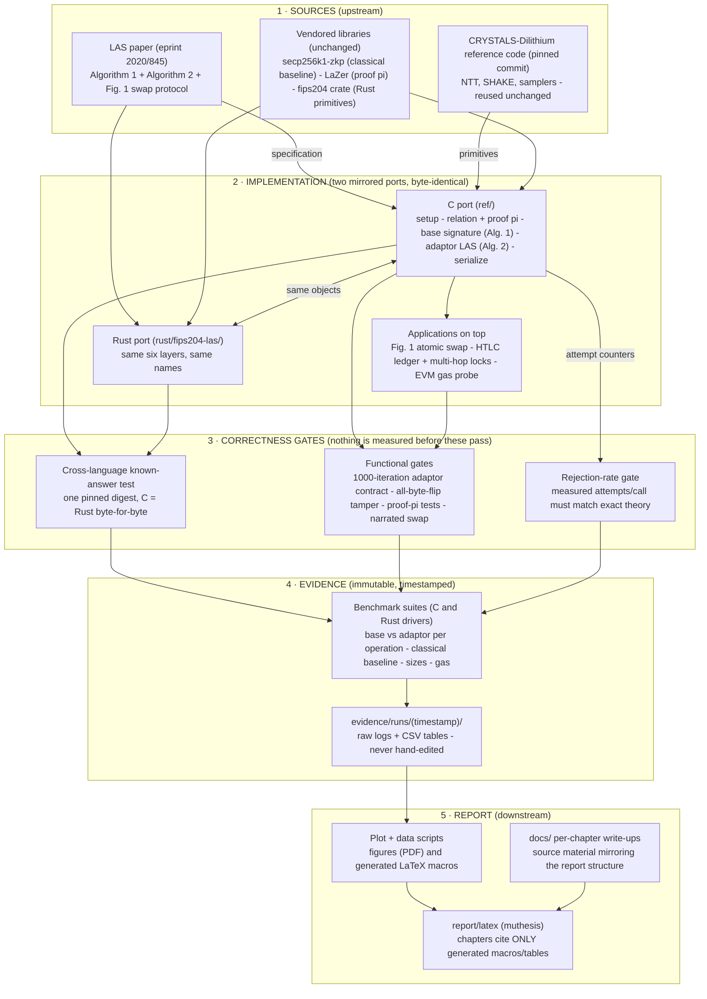

# LAS on Dilithium — quick start

Post-quantum **Lattice-based Adaptor Signature** (LAS; Esgin–Ersoy–Erkin, IACR eprint
2020/845, Algorithm 2 — the *simplified* scheme) built on the CRYSTALS-Dilithium
reference primitives, with a scriptless atomic-swap demo. There are two implementations —
**C** (`ref/`) and **Rust** (`rust/fips204-las/`) — that produce **byte-identical**
objects, cross-checked by a shared known-answer test.

> **Full details:** [README_EXTENDED.md](README_EXTENDED.md) — the complete evidence
> pipeline, every report-table→log mapping, the figure catalogue, and the optional
> baselines. Per-language reproduce guides:
> [docs/A-appendix/REPRODUCE_LAS_C.md](docs/A-appendix/REPRODUCE_LAS_C.md) ·
> [docs/A-appendix/REPRODUCE_LAS_RUST.md](docs/A-appendix/REPRODUCE_LAS_RUST.md).

## The big picture — how everything flows into the report

One diagram, five stages. Every artefact in this repository sits on exactly one of
these arrows: **sources** are consumed by the **implementation**, nothing gets
measured until it passes the **correctness gates**, measurements land as immutable
**evidence**, and the **report** cites only that evidence (never hand-typed numbers).



**How to read this repository, in order** (each step is a strict superset of the
previous — stop whenever you have enough):

1. This diagram, then the two [Key commands](#key-commands) blocks — the whole
   system in two minutes.
2. [docs/01-introduction/LAS_WALKTHROUGH.md](docs/01-introduction/LAS_WALKTHROUGH.md)
   — the plain-English story (no maths).
3. [docs/LAS.md](docs/LAS.md) — the hub: per-chapter design/implementation/results
   write-ups, numbered to match the report.
4. [docs/02-methodology/THEORY_IMPL_BRIDGE.md](docs/02-methodology/THEORY_IMPL_BRIDGE.md)
   — every paper equation mapped to the exact function.
5. [docs/STATUS.md](docs/STATUS.md) + [README_EXTENDED.md](README_EXTENDED.md) —
   what is done, and which log proves each report number.

## Environment

`gcc` (or `clang`) + `make` for C; `cargo` for Rust. The reported numbers used gcc 13.3.0
at `-O3` (no warnings), Ubuntu 24.04 on WSL2, AMD Ryzen 7 7745HX. Modulus
`q = 8380417 ≈ 2²³` (the reused NTT table); `q > 2γ`, so correctness holds.

## Key commands

**C — build and check** (from `ref/`):

```sh
cd ref
make test/test_kat3      && ./test/test_kat3        # deterministic KAT gate (digest below)
make test/test_las3      && ./test/test_las3        # 1000/1000 adaptor cycle (mode 3)
make test/test_serde3    && ./test/test_serde3      # wire round-trip + all-byte-flip tamper
make test/bench_levels3  && ./test/bench_levels3    # primary fair benchmark: base vs LAS adaptor
```

**Rust — build and check** (from `rust/fips204-las/`):

```sh
cd rust/fips204-las
cargo test --offline --test las_kat                       # cross-language KAT gate (same digest)
cargo run  --offline --release --example size_report      # component packed sizes
```

**One-command evidence suites** (from the repo root) — build, run, plot into a timestamped
`evidence/runs/<ts>/` folder:

```sh
bash scripts/run_benchmark_suite.sh     # C
bash scripts/run_rust_bench_suite.sh    # Rust
```

## π + atomic swap (opt-in: vendored LaZer)

`test/test_swap3` implements eprint 2020/845 **Fig. 1 verbatim**, including the proof of
knowledge **π** (knowledge of a ternary `r'` with `A·r' = t'`), realised over the vendored
[LaZer](https://github.com/lazer-crypto/lazer) library via binary decomposition
`[A | −A]·(r₊‖r₋) = t'` — proof ≈ 30.7 KB (off-chain only), knowledge error ≤ 2⁻¹²⁷.
Same opt-in pattern as the classical baseline (`secp256k1-zkp`). One-time setup:

```sh
git clone https://github.com/lazer-crypto/lazer third_party/lazer
# deps without sudo (this machine): conda env with cmake + MPFR
#   mamba create -y -n lazer-build -c conda-forge cmake mpfr
cd third_party/lazer && make lazer.h liblazer.a \
  ADD_CPPFLAGS="-DNDEBUG -I$HOME/micromamba/envs/lazer-build/include" \
  libmpfr="-L$HOME/micromamba/envs/lazer-build/lib -lmpfr"
# HEXL note: if cmake ≥ 4 rejects HEXL, configure it manually with
#   -DCMAKE_POLICY_VERSION_MINIMUM=3.5  and symlink build/hexl/lib64 -> lib
```

Then (from `ref/`):

```sh
make test/test_zkp3   && ./test/test_zkp3    # π: prove/verify + tamper + wrong-statement
make test/test_swap3  && ./test/test_swap3   # Fig. 1 atomic swap incl. π (narrated)
```

**Rust twin** (from `rust/fips204-las/`; FFI to the *same* C bridge + LaZer build, so both
ports run the identical proof system — feature `relation-zk`, off by default, KAT gate
untouched):

```sh
cargo test --offline --features relation-zk --test las_zkp --test las_swap
```

`ref/relation_zk_params.h` is **committed** (generated from `scripts/las_pi_params.py` by
LaZer's `sage lin-codegen.sage`), so SageMath is needed only to *regenerate* parameters,
never to build.

## The gate to trust

Both KATs must print the **same pinned digest** (the cross-language interoperability gate —
it pins keygen + sign + presign + adapt + serialisation over fixed vectors, byte-identical
in C and Rust):

```text
bb6ad0dab998c1f90ca4d3cc0f5d3dfa723e89f79aff18fce2698a08c96e260c
```

At mode 3 the packed signature is **6720 bytes** — a 32-byte challenge digest `c_tilde`
plus `BitPack(z)` (6688 B, ≈99.5%); the wire form is `c_tilde ‖ BitPack(z)`. `test_las3`
reports `1000/1000 iterations (100% correctness)`.

## Layout

```text
ref/setup.{c,h}      shared params + public_params pp=(A,H)
ref/las_types.h      the six protocol object types
ref/relation.{c,h}   hard-relation Gen -> (statement Y, witness r')
ref/relation_zk.{c,h} + relation_zk_lazer.{c,h}  Fig.-1 proof pi over vendored LaZer (opt-in)
ref/basesig.{c,h}    Algorithm 1: base_keygen / base_sign / base_verify   (fair-benchmark baseline)
ref/las.{c,h}        Algorithm 2: las_presign / las_preverify / las_adapt / las_ext
ref/serialize.{c,h}  byte-level codec (wire = c_tilde ‖ BitPack(z)) + validating decoder
ref/{poly,ntt,reduce,fips202,...}.c   reused Dilithium primitives (unmodified)
rust/fips204-las/     Rust port (same layout: setup / las_types / relation / basesig / las / serialize)
scripts/             one-command evidence pipeline (build + run + plot)
evidence/runs/<ts>/   one self-contained folder per run (logs, tables, figures)
```

## Further documentation

| File | Contents |
|---|---|
| [README_EXTENDED.md](README_EXTENDED.md) | Full evidence pipeline + report-table→log map |
| [docs/01-introduction/LAS_WALKTHROUGH.md](docs/01-introduction/LAS_WALKTHROUGH.md) | Plain-English, end-to-end explainer |
| [docs/LAS.md](docs/LAS.md) | Full design / implementation / evaluation write-up |
| [docs/02-methodology/THEORY_IMPL_BRIDGE.md](docs/02-methodology/THEORY_IMPL_BRIDGE.md) | Each construction equation → C function |
| [docs/STATUS.md](docs/STATUS.md) | Deliverable / test checklist |
