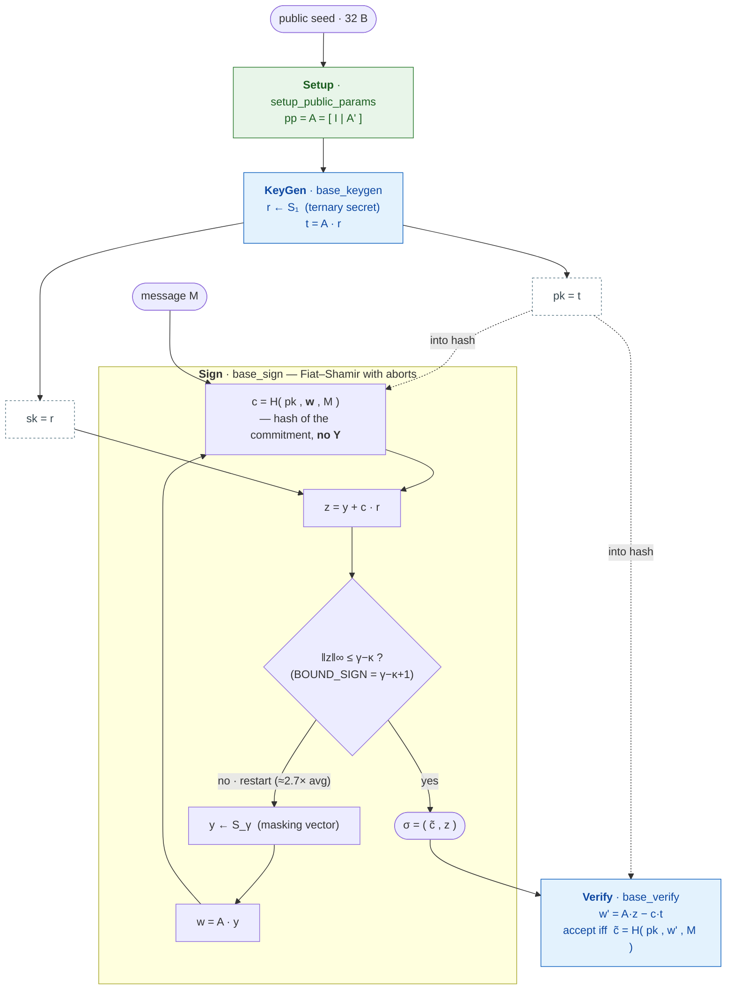
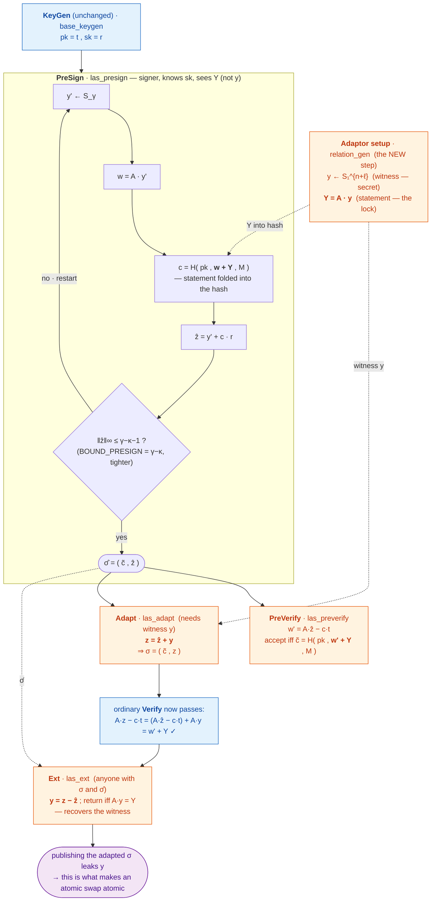
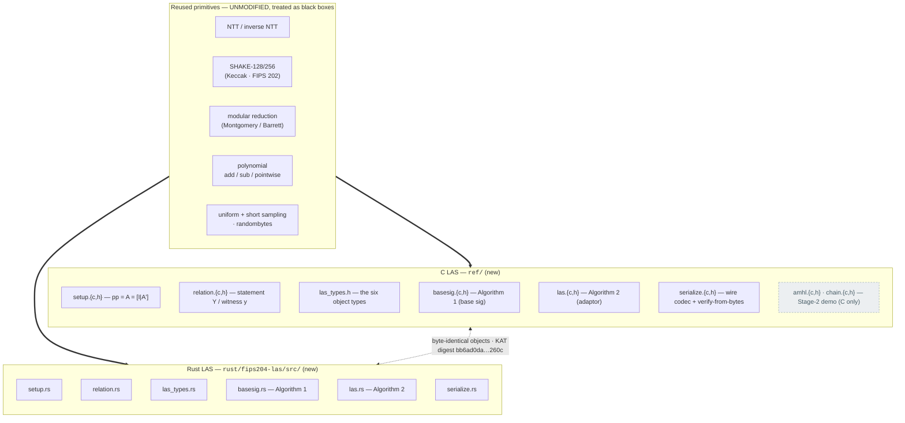

# Stage-1 diagrams & one-page summary (Meeting-5 M5.2 / M5.3 / M5.4 / M5.7)

*The **visual** top of the walkthrough. The A–F folders explain the same story in
prose; this file draws it. Every diagram below is Mermaid (renders on GitHub) and is
the source for the 1–2 slide summary. Notation follows the paper
([`docs/paper/LAS_2020_845_NOTATION.md`](../../paper/LAS_2020_845_NOTATION.md)):
ring degree `d = 256`, `γ = κ·d·(n+ℓ)`, per-set challenge weight `κ`. Headline setting
throughout is **Simplified Dilithium-III**, engineering set `(n, ℓ, κ) = (6, 5, 49)`.*

Read order: **(1) base signature → (2) LAS adaptor → (3) repository structure**, then
the two summary tables. This mirrors Wang's instruction: *start from the basic
`KeyGen/Sign/Verify` API, then show how LAS adds/modifies it.*

---

## Diagram 1 — Base signature API (`KeyGen` / `Sign` / `Verify`)

The ordinary simplified-Dilithium signature, our fair-comparison baseline
(`ref/basesig.c` · `rust/fips204-las/src/basesig.rs`). A Fiat–Shamir-with-aborts
Σ-protocol; **no statement `Y` anywhere**.

---

## Diagram 2 — LAS adaptor API (base **+** `PreSign` / `PreVerify` / `Adapt` / `Ext`)

LAS reuses the *same* `KeyGen`/`Verify` and adds four operations
(`ref/las.c` · `rust/fips204-las/src/las.rs`). **Wang's question — "where is `Y` set
up?" — answered: in a separate relation step (`relation_gen`), *not* in KeyGen and
*not* inside Sign.** `Y` is structurally a second key pair but semantically the
adaptor *lock*.

**The one identity to remember:** `Sign` hashes `w`; `PreSign` hashes `w + Y`. `Adapt`
adds the ternary witness `y` (‖y‖∞ ≤ 1) to `ẑ`; because `PreSign` rejected at the
*tighter* bound `γ−κ−1`, the adapted `z = ẑ + y` still satisfies `‖z‖∞ ≤ γ−κ` and clears
ordinary `Verify`. `Ext` inverts the fold to recover `y`.

---

## Diagram 3 — Repository structure (base primitives · C LAS · Rust LAS)

Both implementations are **additive modules layered on unmodified primitives**. The
green box is reused as-is in each language; the blue/orange modules are the new LAS
code, in one-to-one correspondence C ⇄ Rust. The two are locked together by a shared
known-answer test (byte-identical outputs).

C reuses the vendored **pq-crystals/dilithium** reference (commit `2374d22`):
`poly.c`, `ntt.c`, `reduce.c`, `fips202.c`, `symmetric-shake.c`, `randombytes.c`,
`params.h` (`N=256`, `Q=8380417`). Rust reuses the vendored **`fips204`** crate
(commit `c948882`, v0.4.6): `ntt.rs`, `hashing.rs`, `encodings.rs`, `conversion.rs`,
`helpers.rs`, `high_low.rs`, `ml_dsa.rs`. **Zero upstream functions modified in either
language** (per-function audit: [`FUNCTION_MAP.md`](../FUNCTION_MAP.md); diff view:
[`CODE_DIFF_VIEW.md`](../CODE_DIFF_VIEW.md)).

---

## Table A — Reused / modified / newly-added, at a glance (M5.4 front)

| Layer | Reused unmodified | Newly added for LAS | Why it is (not) modified |
|---|---|---|---|
| Lattice arithmetic (NTT, reduction, poly ops) | ✅ all of it | — | Correct and constant across schemes; LAS only *calls* it — modifying it would break the KAT lock and the clean diff |
| Hashing / sampling (SHAKE, `randombytes`, uniform/short) | ✅ all of it | — | The random oracle `H` and samplers are scheme-agnostic; reused verbatim |
| Size-optimisation layer (Power2Round, Decompose, hints, ω-bound) | present but **bypassed** | — | The simplified scheme **omits** it so the identity `A·z − c·t = w + Y` is exact — the property `Adapt`/`Ext` depend on |
| Base signature (`KeyGen`/`Sign`/`Verify`) | — | `setup`, `basesig` | New relation `[I\|A']`, ternary keys, *full*-`w` hash — a self-contained module, not an edit to `sign.c` |
| Adaptor (`PreSign`/`PreVerify`/`Adapt`/`Ext`) | — | `relation`, `las` | The four new operations + statement fold `w+Y`; this is the project's contribution |
| Wire encoding | — | `serialize` | Object shapes differ from Dilithium's; on-chain byte interface + validating decoder |

Verdict: **the entire arithmetic/hash layer is reused; every LAS-specific line is new;
nothing upstream is edited.** That is the "clean diff = visible contribution" design.

---

## Table B — C ⇄ Rust size cross-check (M5.7)

Communication sizes are **fixed** (no dispersion) and **identical across the two
implementations** — the evidence that the two ports are the same scheme, not
look-alikes. Byte-for-byte identity is proven by the shared KAT digest
`bb6ad0dab998c1f90ca4d3cc0f5d3dfa723e89f79aff18fce2698a08c96e260c`
(`make test/test_kat3` ⇔ `cargo test --test las_kat`).

| Object (packed bytes) | Simplified Dilithium-III `(6,5,49)` | Paper set `(4,4,60)` | C = Rust? |
|---|--:|--:|:--:|
| public key `pk = t` | 4416 | 2944 | ✅ |
| secret key `sk = r` | 704 | 512 | ✅ |
| statement `Y = t'` | 4416 (= pk) | 2944 | ✅ |
| witness `y` | 704 (= sk) | 512 | ✅ |
| signature `σ = (c̃, z)` | 6720 | 4640 | ✅ |
| pre-signature `σ̂ = (c̃, ẑ)` | 6720 (= σ) | 4640 | ✅ |
| adapted signature | 6720 (= σ) | 4640 | ✅ |

**What drives the size:** the response `z` is **≈99.5 %** of the signature (D3: 6688 of
6720 B; the challenge `c̃` is a fixed 32 B). Signature = pre-signature = adapted
signature, because `Adapt` only adds the ternary witness (‖y‖∞ ≤ 1), which does not
widen the packed `z`. The Rust `examples/size_report.rs` hard-asserts these equal the C
evidence row, so the size claim is cross-language by construction.

---

## Table C — Rejection sampling: theory vs measured (M5.8)

Lattice Fiat–Shamir signatures restart until the response is short enough; this drives
the timing and its variance. The per-attempt acceptance probability is
`((2·bound−1)/(2γ+1))^{(n+ℓ)·d} ≈ e^{−1} ≈ 36.8 %`, so the expected number of attempts
per output is `≈ 1/0.368 ≈ 2.7`. Intuitively: each of the `(n+ℓ)·d` response
coefficients must land inside the acceptance window, and the window is sized (via `γ`)
so the whole vector clears it about once every `e` tries — the paper's deliberate
design target.

| Quantity @ Simplified Dilithium-III | Theory (exact) | Measured (direct counter) |
|---|--:|--:|
| `Sign` attempts / signature | 2.71875 | ≈2.72 |
| `PreSign` attempts / pre-signature | 2.77483 | ≈2.81 |
| acceptance / attempt | ≈36.8 % | ≈37 % |

`PreSign`'s tighter bound (`γ−κ−1` vs `γ−κ`) makes it restart *slightly* more often —
the gap between the two theory values re-confirms both bounds. Every benchmark run
hard-asserts the measured attempts against this theory within 5σ, so a run with the
wrong restart rate aborts instead of producing invalid numbers.

---

## Headline findings (2–3 sentences, for the slide) + environment

Compared with the simplified Dilithium-style **base** signature at matched parameters,
the LAS **adaptor** layer adds only a few percent of computation per operation at the
**core / struct-API tier** (`PreSign` +1.6 %, `PreVerify` +5.1 %, `Adapt` +9.0 % vs the
basic op each mirrors; C reference — pure adaptor math). The **full-protocol end-to-end
tier**, which also packs/unpacks every object, is larger (`+20.8 % / +35.3 % / +79.5 %`,
C), because each operation must decode the pk-sized statement `Y`; that serialization
cost, not the adaptor math, drives it. The adaptor layer **does not enlarge the
signature** — pre-signature = adapted signature =
base signature (`Adapt` only adds the ternary witness `y`, ‖y‖∞ ≤ 1). Its **one extra
communication object is the pk-sized statement `Y`** (4416 B, ≈ 65.7 % of a signature) —
not zero, but a single object that does not scale with the message. The dominant
post-quantum cost is **communication** (`pk`/`sig`/`Y` in the low kilobytes, `z` ≈ 99.5 %
of the signature), **not computation** (sub-millisecond ops). C and Rust produce
byte-identical objects (same KAT digest), confirming the implementation is consistent.

> **Timing provenance:** the percentages above are from evidence run
> `20260717_084012` (Simplified Dilithium-III, C reference, core tier); absolute
> microseconds are machine-dependent — **re-run the full Stage-1 suite once on the
> submission machine before quoting final numbers.**
> **Environment of record:** AMD Ryzen 7 7745HX, Ubuntu 24.04 on WSL2, `gcc 13.3.0`
> `-O3` (zero warnings) for C; `cargo` release + Criterion (300 samples/op) for Rust.
> Both languages, every compared scheme, run on the **same machine** (the only fairness
> requirement). Sizes are exact and machine-independent.
